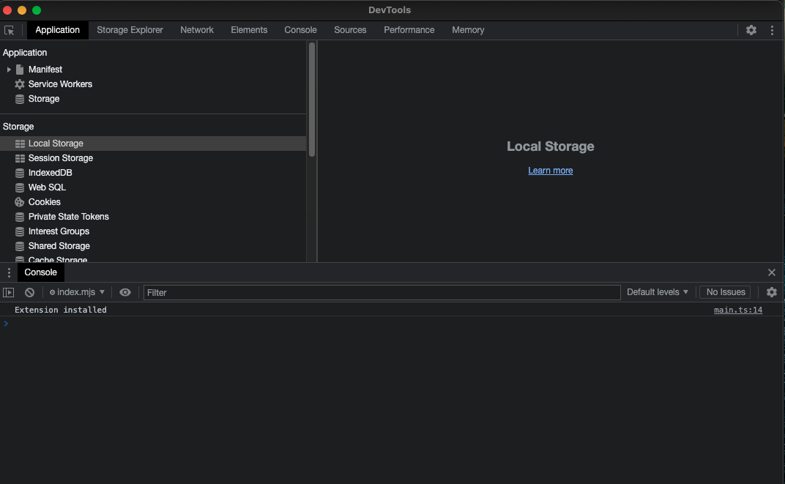
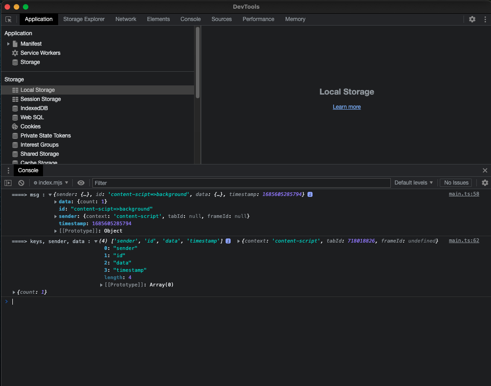

# WebExt Bridge

本文介绍 [WebExt Bridge](https://github.com/zikaari/webext-bridge) 的使用。

## 初始设置
我准备了一个 [demo](https://github.com/Web3HackerWorld/vitesse-webext-tutorial) 代码，在 webext-bridge 分支，方便大家可以快速尝试。

```bash
git clone --depth=1 git@github.com:Web3HackerWorld/vitesse-webext-tutorial.git --branch webext-bridge 
cd vitesse-webext-tutorial
pnpm i
pnpm dev
```

`pnpm dev` 命令使用 `run-p` 同时运行多个 `dev:` 开头的 scripts，其中 `dev:html` 是自动帮你打开一个本地网页，以便你直接查看浏览器扩展的效果。

打开页面后，并不会出现我们的 `Vitesse webext tutorial` 浏览器扩展，需要你打开 `chrome://extensions/`，点击 `Load unpacked`，然后定位到本代码的 `extensions` 目录即可。

注意在修改 `manifest.ts` 文件后，需要你手动删除扩展再重新点击 `Load unpacked` 按钮加载，其他代码的修改可以通过安装 `[Extensions Reloader](https://chrome.google.com/webstore/detail/extensions-reloader/fimgfedafeadlieiabdeeaodndnlbhid)` 来方便你点击按钮即可刷新扩展，当然你可以可以直接打开 `chrome://extensions/`，点击你的扩展的右下角的 `reload` 按钮。

## content-script <=> background

### content-script => background

1. 在 `content-script` (/src/contentScripts/content-scipt) 定义 `content-scipt=>background` 发送按钮的代码

```html
<button @click="doContentScriptToBackground">
  content-scipt=>background
</button>
```

```js
import { sendMessage } from 'webext-bridge/content-script'

const clickCount = ref(1)
const doContentScriptToBackground = async () => {
  await sendMessage('content-scipt=>background', {
    count: clickCount.value,
  }, 'background')
  clickCount.value++
}
```

2. 在 `background` (/src/background/main.ts) 定义消息的接收函数
```js
onMessage('content-scipt=>background', async (msg) => {
  console.log('====> msg :', msg)
  const keys = Object.keys(msg)
  const { sender, data } = msg
  console.log('====> keys, sender, data :', keys, sender, data)
})
```

3. 打开你的扩展的 `service worker` (打开 `chrome://extensions/`，找到 `Vitesse WebExt Tutorial` 扩展，有个 `Inspect views service worker` 按钮，点击后会弹出




4. 点击网页上被扩展注入的 `content-scipt=>background` 按钮，会看到 `service worker` 里出现类似这样的 log。




## content-script <=> popup

## popup <=> background
