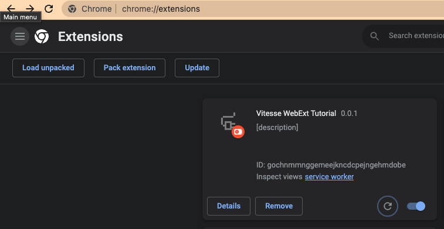

# WebExt Bridge in action

This article introduces the usage of [WebExt Bridge](https://github.com/zikaari/webext-bridge).

`WebExt Bridge` allows you to have a more unified and convenient message transmission logic when developing browser extensions.

## TL;DR

* `content-script <=> background, popup, option`

```js
// content-script
const yourJsonDataToPass = { what: 'ever json you want to pass here' }
await sendMessage('eventNameA', yourJsonDataToPass, 'background')
onMessage('eventNameB', async (msg) => { console.log(msg) })

// background or popup

// currentTabId only can get in background script, so you should store it in storage so in popup we can get the tabId
const currentTabId = ref('')
browser.tabs.onActivated.addListener(async ({ tabId }) => {
  currentTabId.value = tabId
})
onMessage('eventNameA', async (msg) => { console.log(msg) })
await sendMessage('eventNameB', yourJsonDataToPass, `content-script@${tabId}`)
```

* Except for `content-script`, it is relatively simple for other parties to send and receive messages to each other, no need to attach `tabId`

## default setting

I have prepared a [demo](https://github.com/Web3HackerWorld/vitesse-webext-tutorial) code in the webext-bridge branch, so that everyone can try it quickly.

```bash
git clone --depth=1 git@github.com:Web3HackerWorld/vitesse-webext-tutorial.git --branch webext-bridge
cd vitesse-webext-tutorial
pnpm i
pnpm dev
```

The `pnpm dev` command uses `run-p` to run multiple scripts starting with `dev:` at the same time, where `dev:html` is to automatically open a local webpage for you, so that you can directly view the effect of the browser extension.

After opening the page, our `Vitesse webext tutorial` browser extension will not appear, you need to open `chrome://extensions/`, click `Load unpacked`, and then navigate to the `extensions` directory of this code.

Note that after modifying the `manifest.ts` file, you need to manually delete the extension and then click the `Load unpacked` button to load it again. Other code modifications can be done by installing `[Extensions Reloader](https://chrome.google.com/webstore /detail/extensions-reloader/fimgfedafeadlieiabdeeaodndnlbhid)` to facilitate you to click the button to refresh the extension. Of course, you can directly open `chrome://extensions/` and click the `reload` button in the lower right corner of your extension.

## 1. content-script <=> background

### content-script => background

1. In `content-script` (/src/contentScripts/views/App.vue) define `content-scipt=>background` send button code

```html
<button @click="doContentScriptToBackground">
   content-script=>background
</button>
```

```js
import { sendMessage } from 'webext-bridge/content-script'

const clickCount = ref(1)
const doContentScriptToBackground = async () => {
  await sendMessage('content-scipt=>background', {
    count: clickCount.value,
  }, 'background')
  clickCount.value++
}
```

2. Define the message receiving function in `background` (/src/background/main.ts)

```js
onMessage('content-script=>background', async (msg) => {
  console.log('====> msg :', msg)
  const keys = Object.keys(msg)
  const { sender, data } = msg
  console.log('====> keys, sender, data :', keys, sender, data)
})
```

3. Open the `service worker` of your extension (open `chrome://extensions/`, find the `Vitesse WebExt Tutorial` extension, there is an `Inspect views service worker` button, click it and it will pop up




4. Click the `content-scipt=>background` button injected by the extension on the webpage, and you will see a log similar to this in the `service worker`.


### content-script <= background

At this point, we can trigger the `content-script<=background` event when `background` receives a `content-scipt=>background` message.

1. Add the following code in `App.vue` (/src/contentScripts/views/App.vue) to define the `content-scipt<=background` event.

```js
onMessage('content-script<=background', async (msg) => {
  // eslint-disable-next-line no-console
  console.log('====> content-scipt<=background msg :', msg)
  return { cool: 'Got you! I am cool from content-script' }
})
```

2. The `content-scipt=>background` event callback function in `background` (/src/background/main.ts) defines the code that sends a message to `content-scipt<=background`, here we take a trick, in Click on the web interface to trigger the event `background`, and immediately trigger a new event to the front-end `content-script`, the complete code is as follows:

```js
onMessage('content-script=>background', async (msg) => {
  // eslint-disable-next-line no-console
  console.log('====> msg :', msg)
  const keys = Object.keys(msg)
  const { sender, data } = msg
  // eslint-disable-next-line no-console
  console.log('====> keys, sender, data :', keys, sender, data)

  const rz = await sendMessage('content-scipt<=background', {
    time: new Date(),
  }, `content-script@${currentTabId}`)
  // eslint-disable-next-line no-console
  console.log('====> response from content-sciript', rz)

  return { yaha: 'hoho' }
})
```

We also added the returned data to the previous `sendMessage`, so we also modified the previous `doContentScriptToBackground` function

```js
const doContentScriptToBackground = async () => {
  const rz = await sendMessage('content-scipt=>background', {
    count: clickCount.value,
  }, 'background')
  clickCount.value++
  // eslint-disable-next-line no-console

  console.log('====> doContentScriptToBackground sendMessage rz :', rz)
}
```

Click the `reload` button of the extension to reload the extension to trigger the refresh of `service worker`, and then refresh the web page `http://localhost:5173/`, you may need to switch to another tab and then switch back, because We need to get the currently active `tabId` in `background`

```js
let currentTabId = 0
// communication example: send previous tab title from background page
// see shim.d.ts for type declaration
browser.tabs.onActivated.addListener(async ({ tabId }) => {
  currentTabId = tabId
})
```

3. Finally, you can click the button on the web page to trigger `content-sci again
