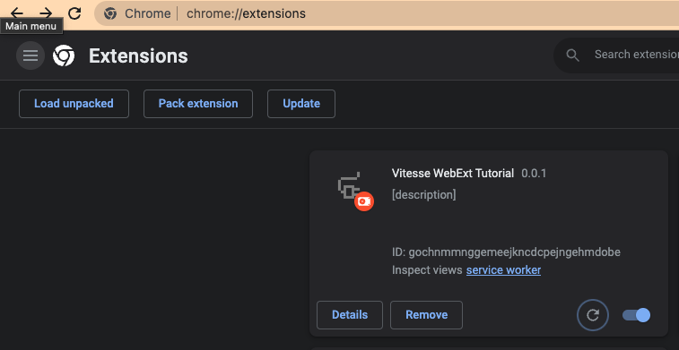
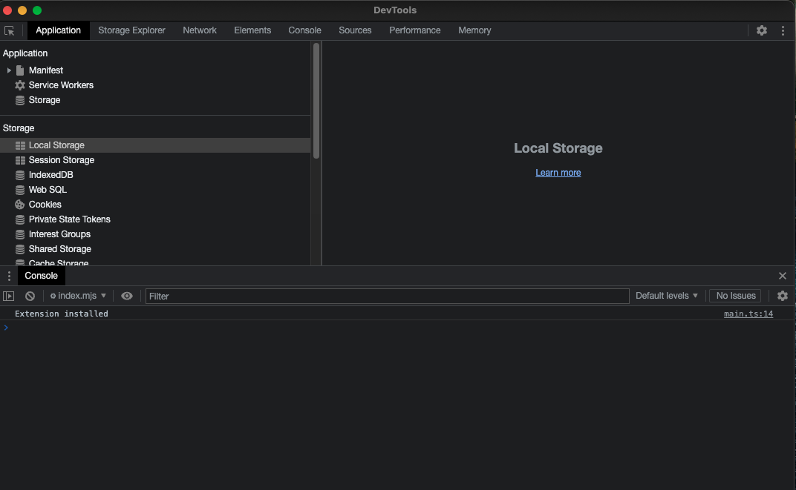
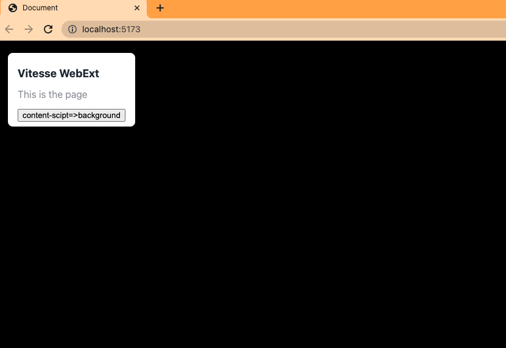
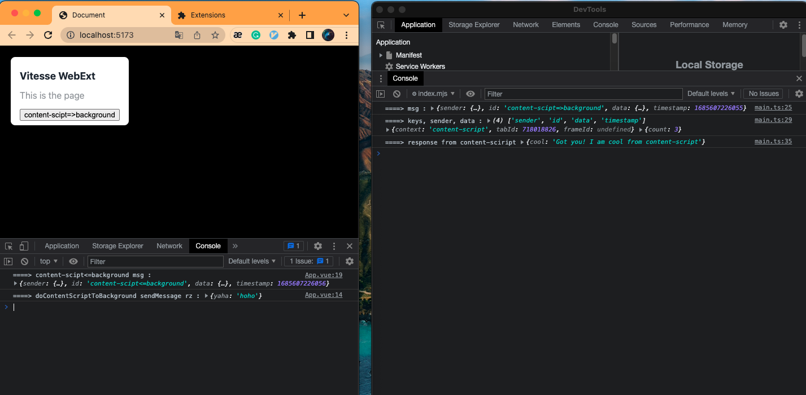
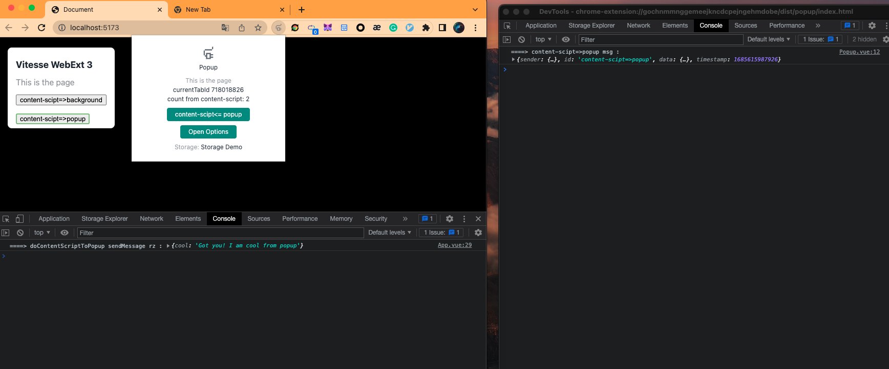
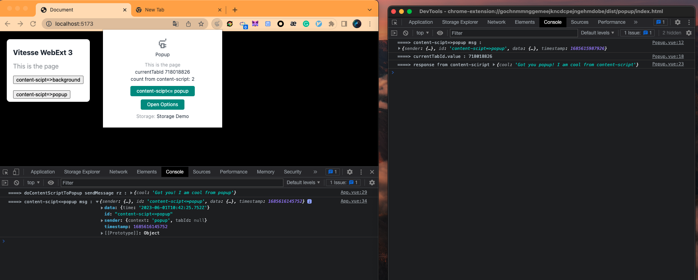
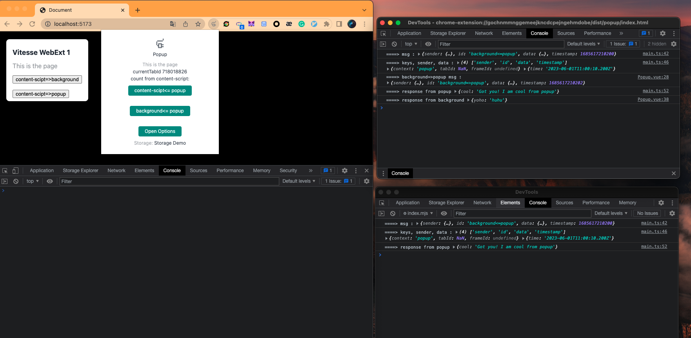

# WebExt Bridge 实战

本文介绍 [WebExt Bridge](https://github.com/zikaari/webext-bridge) 的使用。

`WebExt Bridge` 使得你在开发浏览器扩展时，有更加统一简便的消息传输逻辑。

## TL;DR

* `content-script <=> background, popup, option`
```js
// content-script
const yourJsonDataToPass = { what: 'ever json you want to pass here' }
await sendMessage('eventNameA', yourJsonDataToPass, 'background')
onMessage('eventNameB', async (msg) => { console.log(msg) })

// background or popup

// currentTabId only can get in background script, so you should store it in storage so in popup we can get the tabId
const currentTabId = ref('')
browser.tabs.onActivated.addListener(async ({ tabId }) => {
  currentTabId.value = tabId
})
onMessage('eventNameA', async (msg) => { console.log(msg) })
await sendMessage('eventNameB', yourJsonDataToPass, `content-script@${tabId}`)
```

*  除了 `content-script` 之外，其他各方互相发送接收消息都比较简单，不需要附带 `tabId`


## 初始设置

我准备了一个 [demo](https://github.com/Web3HackerWorld/vitesse-webext-tutorial) 代码，在 webext-bridge 分支，方便大家可以快速尝试。

```bash
git clone --depth=1 git@github.com:Web3HackerWorld/vitesse-webext-tutorial.git --branch webext-bridge 
cd vitesse-webext-tutorial
pnpm i
pnpm dev
```

`pnpm dev` 命令使用 `run-p` 同时运行多个 `dev:` 开头的 scripts，其中 `dev:html` 是自动帮你打开一个本地网页，以便你直接查看浏览器扩展的效果。

打开页面后，并不会出现我们的 `Vitesse webext tutorial` 浏览器扩展，需要你打开 `chrome://extensions/`，点击 `Load unpacked`，然后定位到本代码的 `extensions` 目录即可。

注意在修改 `manifest.ts` 文件后，需要你手动删除扩展再重新点击 `Load unpacked` 按钮加载，其他代码的修改可以通过安装 `[Extensions Reloader](https://chrome.google.com/webstore/detail/extensions-reloader/fimgfedafeadlieiabdeeaodndnlbhid)` 来方便你点击按钮即可刷新扩展，当然你可以可以直接打开 `chrome://extensions/`，点击你的扩展的右下角的 `reload` 按钮。

## 1. content-script <=> background

### content-script => background

1. 在 `content-script` (/src/contentScripts/views/App.vue) 定义 `content-scipt=>background` 发送按钮的代码

```html
<button @click="doContentScriptToBackground">
  content-scipt=>background
</button>
```

```js
import { sendMessage } from 'webext-bridge/content-script'

const clickCount = ref(1)
const doContentScriptToBackground = async () => {
  await sendMessage('content-scipt=>background', {
    count: clickCount.value,
  }, 'background')
  clickCount.value++
}
```

2. 在 `background` (/src/background/main.ts) 定义消息的接收函数

```js
onMessage('content-scipt=>background', async (msg) => {
  console.log('====> msg :', msg)
  const keys = Object.keys(msg)
  const { sender, data } = msg
  console.log('====> keys, sender, data :', keys, sender, data)
})
```

3. 打开你的扩展的 `service worker` (打开 `chrome://extensions/`，找到 `Vitesse WebExt Tutorial` 扩展，有个 `Inspect views service worker` 按钮，点击后会弹出




4. 点击网页上被扩展注入的 `content-scipt=>background` 按钮，会看到 `service worker` 里出现类似这样的 log。




### content-script <= background

此时，我们可以在 `background` 收到 `content-scipt=>background` 消息时触发 `content-script<=background` 事件。

1. 在 `App.vue`（/src/contentScripts/views/App.vue）添加如下代码，定义 `content-scipt<=background` 事件。

```js
onMessage('content-scipt<=background', async (msg) => {
  // eslint-disable-next-line no-console
  console.log('====> content-scipt<=background msg :', msg)
  return { cool: 'Got you! I am cool from content-script' }
})
```

2. 在 `background` (/src/background/main.ts) 的 `content-scipt=>background` 事件回调函数定义发送消息给 `content-scipt<=background` 的代码，这里我们取巧了下，在网页界面上点击触发事件 `background` 收到后，立即又触发一个新的事件给前端的 `content-script`, 完整代码如下：

```js
onMessage('content-scipt=>background', async (msg) => {
  // eslint-disable-next-line no-console
  console.log('====> msg :', msg)
  const keys = Object.keys(msg)
  const { sender, data } = msg
  // eslint-disable-next-line no-console
  console.log('====> keys, sender, data :', keys, sender, data)

  const rz = await sendMessage('content-scipt<=background', {
    time: new Date(),
  }, `content-script@${currentTabId}`)
  // eslint-disable-next-line no-console
  console.log('====> response from content-sciript', rz)

  return { yaha: 'hoho' }
})
```

我们在这里也添加了返回数据给前面的 `sendMessage` 了，这样我们也一并改造下前面的 `doContentScriptToBackground` 函数

```js
const doContentScriptToBackground = async () => {
  const rz = await sendMessage('content-scipt=>background', {
    count: clickCount.value,
  }, 'background')
  clickCount.value++
  // eslint-disable-next-line no-console

  console.log('====> doContentScriptToBackground sendMessage rz :', rz)
}
```

点击下扩展的  `reload` 按钮，重载下扩展以便触发 `service worker` 刷新，然后刷新下网页 `http://localhost:5173/`，可能还需要切换到别的 tab 再切回来下，因为我们需要在 `background` 获得当前激活的 `tabId`

```js
let currentTabId = 0
// communication example: send previous tab title from background page
// see shim.d.ts for type declaration
browser.tabs.onActivated.addListener(async ({ tabId }) => {
  currentTabId = tabId
})
```

3. 最后可以点击网页上的按钮，再次触发 `content-scipt=>background` 事件了，`background` 收到这个事件后，也触发了新的 `content-scipt<=background` 事件给网页的 `contentScripts`



## content-script <=> popup

1. 在 `content-script` (/src/contentScripts/views/App.vue) 定义 `content-scipt=>popup` 发送按钮的代码以及 `content-scipt<=popup` 接收消息的事件代码。

```html
<br>
<br>
<button @click="doContentScriptToPopup">
  content-scipt=>popup
</button>
```

```js
const doContentScriptToPopup = async () => {
  const rz = await sendMessage('content-scipt=>popup', {
    count: clickCount.value,
  }, 'popup')
  clickCount.value++
  // eslint-disable-next-line no-console
  console.log('====> doContentScriptToPopup sendMessage rz :', rz)
}

onMessage('content-scipt<=popup', async (msg) => {
  // eslint-disable-next-line no-console
  console.log('====> content-scipt<=popup msg :', msg)
  return { cool: 'Got you popup! I am cool from content-script' }
})
```

2. 在 `popup` （/src/popup/views/popup.vue）定义事件 `content-scipt=>popup` 以及 `sendMessageToContentScript` 按钮，这样我们在 popup 里面点击按钮可以触发逻辑来给 contentScript 发消息。我们定义了 `currentTabId` 到 `storage` 里面，这样我们在 `popup` 里才能获得当前激活的 `tabId`，这样才有办法往该  `tabId` 的 `content-script` 发送消息。

```js
import { currentTabId } from '~/logic/storage'

const count = ref(0)
onMessage('content-scipt=>popup', async (msg) => {
  // eslint-disable-next-line no-console
  console.log('====> content-scipt=>popup msg :', msg)
  count.value = msg.data.count
  return { cool: 'Got you! I am cool from popup' }
})

const sendMessageToContentScript = async () => {
  console.log('====> currentTabId.value :', currentTabId.value)
  const rz = await sendMessage('content-scipt<=popup', {
    time: new Date(),
  }, `content-script@${currentTabId.value}`)
  // eslint-disable-next-line no-console
  console.log('====> response from content-sciript', rz)
}
```

```html
currentTabId {{ currentTabId }} <br >
count from content-script: {{ count }}
<button class="mt-2 btn" @click="sendMessageToContentScript">
  content-scipt&lt;= popup
</button>
```

3. 现在可以右键点击浏览器扩展图标，点击弹出的菜单最底部的菜单项 `Inspect Popup`, 然后点击左侧的 `content-scipt=>popup`，可以看到 `content-script` 往 `popup` 发送的消息了，并且 `popup` 里的事件接收回调还返回了 `{ cool: 'Got you! I am cool from popup' }` 给 `content-script`。注意，这里只有打开了 `popup` 弹出，才有成功注册 `content-scipt=>popup` 事件监听，如果还未打开 `popup` 弹窗就在页面上点击  `content-scipt=>popup` 会报错的。因为 `popup` 的代码压根没有运行。所有这种场景估计实际开发中是用的比较少。



4. 再点击 `popup` 里的 `content-scipt<=popup` 按钮，则可以看到 `content-script` 的 `content-scipt<=popup` 事件监听回调触发，并返回 `{ cool: 'Got you popup! I am cool from content-script' }` 给了`popup`



## popup <=> background

1. 在 `background` 里添加事件监听以及发送代码

```js
onMessage('background<=popup', async (msg) => {
  // eslint-disable-next-line no-console
  console.log('====> msg :', msg)
  const keys = Object.keys(msg)
  const { sender, data } = msg
  // eslint-disable-next-line no-console
  console.log('====> keys, sender, data :', keys, sender, data)

  const rz = await sendMessage('background=>popup', {
    time: new Date(),
  }, 'popup')
  // eslint-disable-next-line no-console
  console.log('====> response from popup', rz)

  return { yoho: 'huhu' }
})
```

2. 在 `popup` 里添加事件监听以及发送代码

```js
onMessage('background=>popup', async (msg) => {
  // eslint-disable-next-line no-console
  console.log('====> background=>popup msg :', msg)
  count.value = msg.data.count
  return { cool: 'Got you! I am cool from popup' }
})

const sendMessageToBackground = async () => {
  const rz = await sendMessage('background<=popup', {
    time: new Date(),
  }, 'background')
  // eslint-disable-next-line no-console
  console.log('====> response from background', rz)
}
```

```html
<br>
<br>
<button class="mt-2 btn" @click="sendMessageToBackground">
  background&lt;= popup
</button>
```

3. 如图，打开 `service worker` 的 console （右侧下方） 以及 `popup` 的 console（右侧上方）


